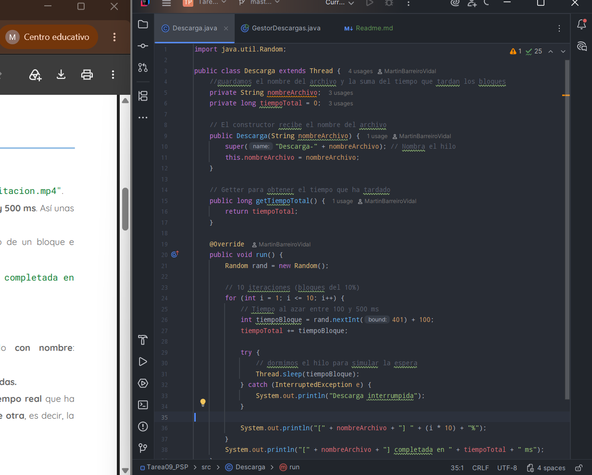
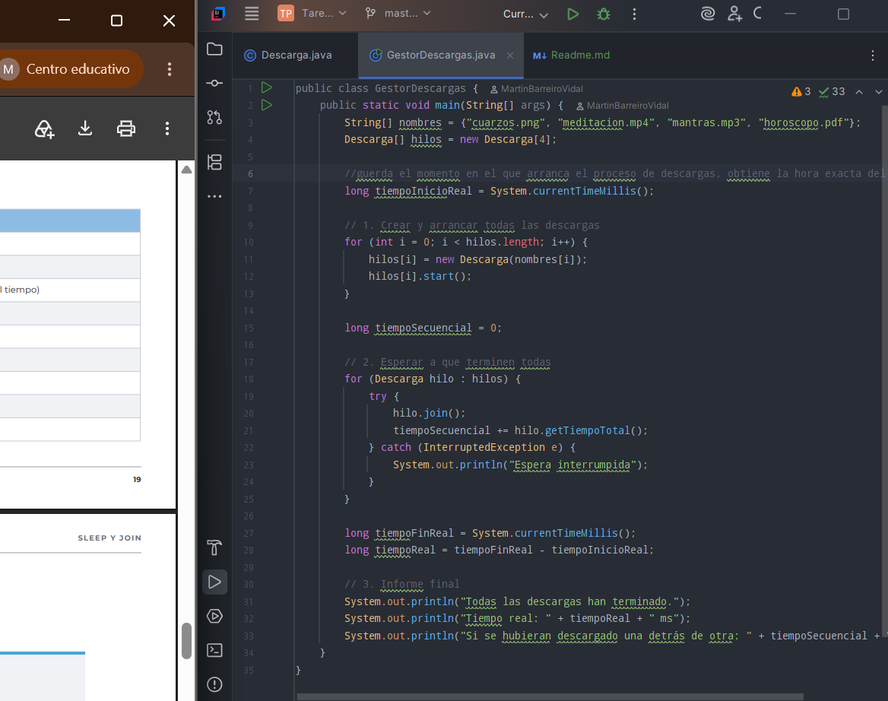
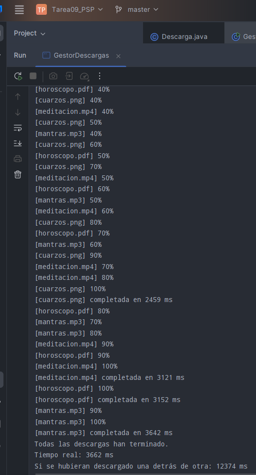

## DOCUMENTACIÓN TAREA09 PSP

### Nivel 1 - Obligatorio

#### Clase Descarga

Simula descargar un archivo en 10 partes haciendo pausas al azar. Al terminar, guarda el tiempo total que ha tardado en completarse.

#### Clase GestorDescargas

Es el programa principal que arranca las cuatro descargas a la vez y las espera. Al acabar, muestra el tiempo real frente a lo que tardaría una tras otra.

